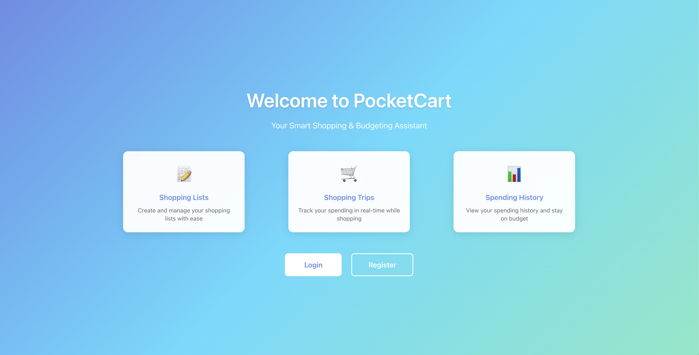

# PocketCart

A Smart Shopping & Budgeting Assistant

## Description

PocketCart is a web application that helps users create shopping lists and track their spending in real-time during shopping trips. It allows users to create customizable shopping lists, track spending as items are purchased, set budget limits, and query historical spending by date range.

## Author

[Yian Zhou](https://github.com/zyan-repository)

## Class link

[class link](https://northeastern.instructure.com/courses/225993)

## Screenshot



## Features

- Shopping List Management (CRUD operations)
- Real-time Spending Tracking
- Budget Setting and Monitoring
- Historical Spending Query by Date Range
- Item Check-off Functionality

## Technology Stack

- **Backend**: Node.js, Express.js
- **Database**: MongoDB (native driver)
- **Frontend**: React (with hooks), Vite
- **API Communication**: Fetch API (no axios)

## Project Structure

```text
PocketCart/
├── client/                # Frontend application
│   ├── src/
│   │   ├── pages/        # Page components
│   │   │   ├── ShoppingListPage.jsx
│   │   │   ├── ShoppingTripPage.jsx
│   │   │   └── SpendingHistoryPage.jsx
│   │   ├── components/   # UI components
│   │   ├── services/     # API service layer
│   │   └── App.jsx       # Main app component
│   └── public/           # Static files
├── server/                # Backend application
│   ├── app.js            # Main server file
│   ├── config/           # Database configuration
│   ├── models/           # Data models
│   │   ├── ShoppingList.js
│   │   └── ShoppingTrip.js
│   └── routes/           # API routes
│       ├── shoppingLists.js
│       └── shoppingTrips.js
└── DESIGN.md             # Design document
```

## API Endpoints

### Shopping Lists

- `GET /api/shopping-lists` - Get all shopping lists
- `GET /api/shopping-lists/:id` - Get single shopping list
- `POST /api/shopping-lists` - Create new shopping list
- `PUT /api/shopping-lists/:id` - Update shopping list
- `DELETE /api/shopping-lists/:id` - Delete shopping list

### Shopping Trips

- `GET /api/shopping-trips` - Get all shopping trips
- `GET /api/shopping-trips/:id` - Get single shopping trip
- `GET /api/shopping-trips/history?startDate=YYYY-MM-DD&endDate=YYYY-MM-DD` - Get trips by date range
- `POST /api/shopping-trips` - Create new shopping trip
- `PUT /api/shopping-trips/:id` - Update shopping trip
- `DELETE /api/shopping-trips/:id` - Delete shopping trip

## Database Collections

### shoppingLists

```json
{
  "_id": "ObjectId('...')",
  "name": "Weekly Groceries",
  "items": [
    {
      "itemId": "item-1234567890-abc123",
      "name": "Milk",
      "quantity": 2,
      "checked": false,
      "price": null
    }
  ],
  "createdAt": "ISODate('...')",
  "updatedAt": "ISODate('...')"
}
```

### shoppingTrips

```json
{
  "_id": "ObjectId('...')",
  "listId": "ObjectId('...')",
  "items": [
    {
      "itemId": "item-1234567890-abc123",
      "name": "Milk",
      "price": 3.99,
      "quantity": 2,
      "checked": true
    }
  ],
  "totalAmount": 7.98,
  "tripDate": "ISODate('...')",
  "createdAt": "ISODate('...')",
  "updatedAt": "ISODate('...')"
}
```

## Setup Instructions

### Backend

1. Navigate to the server directory and install dependencies:

   ```bash
   cd server
   npm install
   ```

2. Create a `.env` file in the `server/` directory:

   **Option 1: Using MongoDB Atlas (Recommended)**

   ```bash
   MONGODB_TYPE=atlas
   MONGODB_ATLAS_USERNAME=your_username
   MONGODB_ATLAS_PASSWORD=your_password
   MONGODB_ATLAS_CLUSTER=your-cluster.mongodb.net
   MONGODB_ATLAS_APP_NAME=your-app-name
   DB_NAME=pocketcart
   PORT=3000
   NODE_ENV=development
   ```

   **Option 2: Using Local MongoDB**

   ```bash
   MONGODB_TYPE=local
   MONGODB_URI=mongodb://localhost:27017
   DB_NAME=pocketcart
   PORT=3000
   NODE_ENV=development
   ```

   **Note:** `MONGODB_ATLAS_CLUSTER` and `MONGODB_ATLAS_APP_NAME` are optional. If not set, default values will be used.

3. Start the server:

   ```bash
   npm run dev
   ```

   The server will run on `http://localhost:3000`

### Frontend

1. Navigate to the client directory and install dependencies:

   ```bash
   cd client
   npm install
   ```

2. Configure environment variables (optional):

   The frontend uses environment variables to configure the API base URL:
   - **Development**: Uses Vite proxy (no configuration needed, `.env` is empty by default)
   - **Production**: Set `VITE_API_BASE_URL` in `.env.production` (already configured)

   The `.env` file is already created with default development settings.
   For production builds, the `.env.production` file is used automatically.

3. Start the development server:

   ```bash
   npm run dev
   ```

   The frontend will run on `http://localhost:5173` and proxy API requests to `http://localhost:3000`

## AI Usage

- This README was generated with AI assistance, referencing the structure and format from a previous project ([TechTrove](https://github.com/zyan-repository/TechTrove)).
- Frontend CSS styling and responsive design were enhanced with AI assistance for improved aesthetics and mobile compatibility.

## Live Demo

- **Production URL**: [https://pocketcart.onrender.com/](https://pocketcart.onrender.com/)

## License

MIT License - see [LICENSE](./LICENSE) file for details
